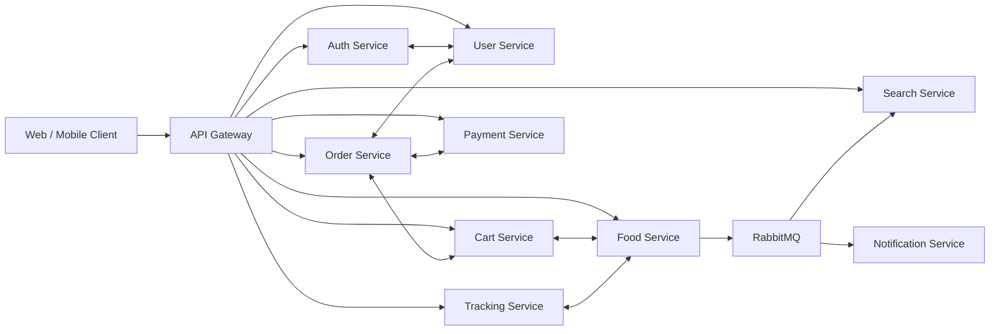

# Foodly - Food Ordering Microservices System

[](https://dotnet.microsoft.com/)
[](https://microservices.io/)
[](https://en.wikipedia.org/wiki/Domain-driven_design)
[](https://www.rabbitmq.com/)
[](https://www.docker.com/)

Foodly is a backend-focused food ordering platform built with .NET 8 and a microservices architecture. The system separates business capabilities into independent services for authentication, users, product catalog, cart, orders, payments, search, notifications, and user behavior tracking.

The project demonstrates practical backend engineering patterns such as Domain-Driven Design, event-driven communication, gRPC service-to-service calls, polyglot persistence, Redis caching, Elasticsearch indexing, object storage with MinIO, and AI-assisted food recommendations.

## Project Preview


## Web UI Screenshots

### Home App


### Admin App


Frontend repository: [Food Ordering Microservices Frontend](https://github.com/khongphaiduc/food-ordering-microservices-frontend)

## Architecture Overview

Foodly follows a microservices architecture where each service owns its domain logic and persistence model. REST APIs are exposed through the API Gateway for client-facing workflows, while gRPC is used for internal low-latency communication between services. RabbitMQ supports asynchronous workflows such as product indexing, notification delivery, and recommendation events.



## Services

| Service | Responsibility | Communication | Persistence / Dependencies |
| :--- | :--- | :--- | :--- |
| API Gateway | Central routing, reverse proxy, CORS | REST | Ocelot |
| Auth Service | Login, signup, JWT, refresh tokens, staff accounts | REST, gRPC client, RabbitMQ | SQL Server, Redis |
| User Service | User profile and address information | REST, gRPC server | SQL Server |
| Food Service | Products, categories, images, recommendations | REST, gRPC server/client, RabbitMQ | PostgreSQL, Redis, MinIO |
| Cart Service | User cart creation and cart item updates | REST, gRPC server/client | PostgreSQL |
| Order Service | Order lifecycle, order history, admin order management | REST, gRPC server/client, SignalR | SQL Server |
| Payment Service | Payment order creation and payment webhook handling | REST, gRPC client, SignalR | SQL Server |
| Search Service | Product search, suggestions, indexing | REST, RabbitMQ | Elasticsearch, PostgreSQL |
| Notification Service | Notification records and email consumer | RabbitMQ worker | PostgreSQL, SMTP |
| Tracking Service | User behavior tracking and recommendation support | REST, gRPC server, RabbitMQ | PostgreSQL, Redis, Gemini API |

## Infrastructure

The project uses Docker Compose to provision the required infrastructure and run the services.

| Component | Docker Port | Purpose |
| :--- | :---: | :--- |
| SQL Server | `1433` | Auth, user, order, and payment data |
| PostgreSQL | `5432` | Product, cart, notification, and tracking data |
| RabbitMQ | `5672`, `15672` | Message broker and management UI |
| Redis | `6379` | Caching and session-related data |
| Elasticsearch | `9200`, `9300` | Search index and product discovery |
| MinIO | `9000`, `9001` | S3-compatible object storage |
| API Gateway | `9080` | Client entry point in Docker |

## Tech Stack

- Backend: .NET 8, ASP.NET Core Web API, gRPC
- Architecture: Microservices, Domain-Driven Design, layered services
- Messaging: RabbitMQ, MassTransit, background workers
- Databases: SQL Server, PostgreSQL
- Search: Elasticsearch
- Cache: Redis
- Storage: MinIO
- Realtime: SignalR
- AI integration: Gemini API for recommendation support
- Deployment: Docker, Docker Compose
- Testing: xUnit, Moq, EF Core InMemory

## Repository Structure

```text
.
|-- ApiGateway/
|-- auth-services/
|-- user-service/
|-- food-service/
|-- cart-service/
|-- order-service/
|-- payment-service/
|-- search-service/
|-- notification-service/
|-- tracking-service/
|-- Foodly.Tests/
|-- docker-compose.yml
`-- food-ordering-microservices-system.sln
```

## Getting Started

### Prerequisites

- .NET SDK 8 or newer
- Docker Desktop
- Git

### Clone the repository

```bash
git clone https://github.com/khongphaiduc/food-ordering-microservices-ddd.git
cd food-ordering-microservices-ddd
```

### Run with Docker Compose

```bash
docker compose up --build
```

The API Gateway is available at:

```text
http://localhost:9080
```

RabbitMQ Management UI:

```text
http://localhost:15672
```

MinIO Console:

```text
http://localhost:9001
```

### Build locally

```bash
dotnet build food-ordering-microservices-system.sln
```

### Run tests

```bash
dotnet test Foodly.Tests/Foodly.Tests.csproj
```

Current test coverage includes service-layer unit tests for authentication, user profile, food category, cart creation, order status updates, and tracking behavior.

## Key Features

- JWT authentication with access and refresh token support
- Role-based access control for admin and staff workflows
- Product and category management
- Cart lifecycle and item quantity updates
- Order creation, order history, and admin status management
- Payment order creation and webhook-based order update
- Product search and suggestions with Elasticsearch
- Event-driven product synchronization and notifications
- User behavior tracking for recommendation workflows
- gRPC-based internal communication between services
- Dockerized infrastructure for local development

## Engineering Highlights

### Domain-Driven Design

Core business rules are modeled through aggregates, entities, value objects, repositories, and application services. This keeps business behavior separated from infrastructure concerns.

### Event-Driven Workflows

RabbitMQ and MassTransit are used to decouple services. Product changes, notifications, and recommendation-related workflows can be processed asynchronously without blocking user-facing requests.

### gRPC Communication

Internal service calls use Protocol Buffers and gRPC where low-latency communication is important, such as cart-to-food, order-to-cart, order-to-user, and payment-to-order flows.

### Polyglot Persistence

Different services use different persistence technologies depending on their workload: SQL Server for identity and transactional modules, PostgreSQL for product/cart/tracking data, Elasticsearch for search, Redis for caching, and MinIO for object storage.

## Configuration Notes

The current Docker Compose file contains local development credentials for infrastructure services. For production deployment, move secrets and connection strings to a secure configuration provider such as environment variables, Docker secrets, Azure Key Vault, AWS Secrets Manager, or another secret manager.

Recommended production improvements:

- Use HTTPS termination at a gateway or ingress layer.
- Store secrets outside source control.
- Run EF Core migrations as a deployment step instead of during application startup.
- Add health checks for all services.
- Add distributed tracing and centralized logging.
- Add integration tests for end-to-end business flows.

## Author

Pham Trung Duc  
Email: ptrungduc1011@gmail.com

## License

This project is intended for learning, demonstration, and portfolio purposes.
