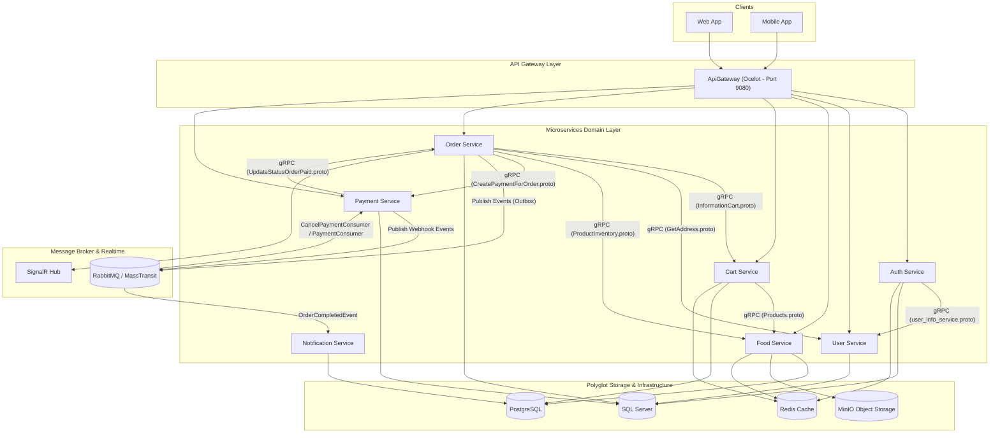

| Side | Desktop / Tablet | Mobile |
|------|------------------|--------|
| Customer | [▶️ Watch Demo](https://drive.google.com/file/d/1NjsbKt0ZSbpr7LE8tju6pzWbFlIOy0ks/view?usp=drive_link) | [▶️ Watch Video](https://drive.google.com/file/d/1s0AH2Ivy3C1r_RPxj5XRG-CHe2U0LvXq/view?usp=drive_link) |
| Admin | Coming Soon | Coming Soon |

# Foodly - Food Ordering Microservices System

[](https://dotnet.microsoft.com/)
[](https://microservices.io/)
[](https://en.wikipedia.org/wiki/Domain-driven_design)
[](https://www.rabbitmq.com/)
[](https://grpc.io/)
[](https://payos.vn/)
[](https://www.docker.com/)

Foodly is a modern, production-ready backend food ordering platform built with **.NET 8** and a **Microservices Architecture**. Designed using **Clean Architecture** and **Domain-Driven Design (DDD)** principles, the system decouples core business capabilities into 8 independent microservices handling authentication, user profiles, food catalog & inventory, shopping cart, order lifecycle, payments, notifications, and central API routing.

The project demonstrates advanced enterprise backend engineering patterns including **gRPC inter-service communication**, **Event-Driven Architecture with MassTransit & RabbitMQ**, **Outbox / Inbox Transactional Messaging Pattern**, **PayOS payment gateway integration**, **MinIO S3-compatible object storage**, **Redis caching**, **SignalR real-time updates**, and **Jenkins CI/CD automation**.

---

## 📸 Project & Web UI Screenshots

### Architecture Preview


### Desktop & Tablet UI


### Mobile Phone UI

 

### Admin Management App


> Frontend repository: [Food Ordering Microservices Frontend](https://github.com/khongphaiduc/food-ordering-microservices-frontend)

---

## 🏗️ Architecture Overview

The system consists of **8 distinct microservices** coordinated through an **API Gateway (Ocelot)** for client-facing HTTP/REST endpoints, **gRPC** for low-latency internal service-to-service RPCs, and **RabbitMQ via MassTransit** for asynchronous event publishing and transactional Outbox messaging.



---

## 🧩 Microservices Breakdown

| Service | Subfolder | Primary Responsibility | Inter-Service Protocol | Databases & Infra |
| :--- | :--- | :--- | :--- | :--- |
| **API Gateway** | `ApiGateway/` | Entry point, reverse proxy, routing, rate limiting & CORS handling | REST (Ocelot) | Docker (`:9080`) |
| **Auth Service** | `auth-services/` | Identity, signup, login, JWT token generation, refresh tokens & staff RBAC | REST, gRPC Client | SQL Server, Redis |
| **User Service** | `user-service/` | Customer profiles & delivery address book management | REST, gRPC Server | SQL Server |
| **Food Service** | `food-service/` | Product catalog, food categories, daily inventory, food recommendations & MinIO image uploads | REST, gRPC Server/Client, MassTransit Consumer | PostgreSQL, Redis, MinIO |
| **Cart Service** | `cart-service/` | Shopping cart lifecycle, item add/remove/update | REST, gRPC Server/Client | PostgreSQL, Redis |
| **Order Service** | `order-service/` | Order creation, status lifecycle, history, SignalR real-time updates & automated expiration background worker | REST, gRPC Client, MassTransit Outbox/Inbox, SignalR | SQL Server, RabbitMQ |
| **Payment Service** | `payment-service/` | PayOS payment gateway integration, payment link creation & webhook status callbacks | REST, gRPC Server/Client, MassTransit Outbox/Inbox | SQL Server, RabbitMQ, PayOS API |
| **Notification Service** | `notification-service/` | Asynchronous email confirmations upon order completion | MassTransit Consumer | PostgreSQL, RabbitMQ, SMTP |

---

## 🔄 gRPC Inter-Service Communication

Low-latency synchronous service calls are handled via gRPC Protocol Buffers:

```text
[Auth Service]   ---- user_info_service.proto ---->  [User Service]   (Retrieve user profile for authentication claims)
[Cart Service]   ---- Products.proto ------------->  [Food Service]   (Validate product details & live prices)
[Order Service]  ---- InformationCart.proto ------->  [Cart Service]   (Fetch active cart items during checkout)
[Order Service]  ---- GetAddress.proto ----------->  [User Service]   (Retrieve customer shipping address)
[Order Service]  ---- ProductInventory.proto ------>  [Food Service]   (Verify stock & reserve items)
[Order Service]  <--- CreatePaymentForOrder.proto -> [Payment Service] (Initiate PayOS payment transaction)
[Payment Service] --- UpdateStatusOrderPaid.proto -> [Order Service]  (Mark order as Paid upon payment completion)
```

---

## ⚡ Event-Driven Messaging & Outbox Pattern

Asynchronous operations are managed using **RabbitMQ** and **MassTransit**:
- **Transactional Outbox/Inbox Pattern**: Integrated via EF Core in `Order Service` and `Payment Service` to guarantee message delivery without distributed transaction failures.
- **PayOS Webhooks**: Webhook callbacks received by `Payment Service` trigger `PaymentConsumer` and `HandleOrderPaySuccessfullyConsumer` to transition order states safely.
- **Email Notifications**: Upon order completion, an `OrderCompletedEvent` is published to RabbitMQ. `Notification Service` (`SendEmailConsumer`) processes the event and dispatches rich HTML email receipts via SMTP.
- **Order Expiration Worker**: A background worker (`CheckExpireOrder`) periodically scans for unpaid pending orders and marks them as expired.

---

## 🗄️ Infrastructure & Port Mappings

The project provisions all required infrastructure services via **Docker Compose**:

| Container | Image | Host Port | Purpose |
| :--- | :--- | :---: | :--- |
| **API Gateway** | `ptrungduc1011/foodlyapigateway` | `9080:8080` | Central public entry point |
| **SQL Server** | `mcr.microsoft.com/mssql/server:2022-latest` | `1888:1433` | Data store for Auth, User, Order, Payment services |
| **PostgreSQL** | `postgres:17-alpine` | `5555:5432` | Data store for Food, Cart, Notification services |
| **RabbitMQ** | `rabbitmq:3-management-alpine` | `5672`, `15672` | AMQP message broker & Management Console |
| **Redis** | `redis:alpine` | `6379:6379` | High-speed cache for catalog & cart sessions |
| **MinIO** | `minio/minio` | `9000`, `9001` | S3-compatible image object storage & console UI |

---

## 📂 Repository Structure

```text
.
├── ApiGateway/                  # Ocelot API Gateway project
├── auth-services/               # Identity, Auth & JWT Service (Clean Architecture)
├── user-service/                # User Profile & Address Service
├── food-service/                # Product, Category & Storage (MinIO) Service
├── cart-service/                # Shopping Cart Service
├── order-service/               # Order Management, SignalR & Worker Service
├── payment-service/             # PayOS Payment Integration & Webhook Service
├── notification-service/        # Asynchronous Email Notification Service (MassTransit)
├── Foodly.Tests/                # xUnit unit testing project for core services
├── docker-compose.yml           # Multi-container orchestration specification
├── Jenkinsfile                  # Automated CI/CD build & deploy pipeline script
└── food-ordering-microservices-system.sln
```

---

## 🚀 Getting Started

### Prerequisites

- [.NET 8.0 SDK](https://dotnet.microsoft.com/download/dotnet/8.0)
- [Docker Desktop](https://www.docker.com/products/docker-desktop/)
- [Git](https://git-scm.com/)

### 1. Clone the Repository

```bash
git clone https://github.com/khongphaiduc/food-ordering-microservices-system.git
cd food-ordering-microservices-system
```

### 2. Run Infrastructure & Services with Docker Compose

```bash
docker compose up --build -d
```

### 3. Service Access Endpoints

- **API Gateway (Public Entry Point)**: `http://localhost:9080`
- **RabbitMQ Management Dashboard**: `http://localhost:15672` (Default login: `guest` / `guest`)
- **MinIO Console**: `http://localhost:9001`

---

## 🧪 Testing

The solution includes comprehensive unit test suites covering the application services, repositories, and domain logic using **xUnit**, **Moq**, and **EF Core InMemory Database**.

Run tests from the repository root:

```bash
dotnet test Foodly.Tests/Foodly.Tests.csproj
```

Included unit tests cover:
- **AuthService**: User login, password hashing, JWT token validation & token refresh mechanics.
- **UserService**: Profile updates & address book management.
- **FoodService**: Category creation, product list queries & daily inventory management.
- **CartService**: Cart item initialization, quantity adjustments & cart clearing.
- **OrderService**: Order status state machine transitions & order validation.

---

## 🔄 CI/CD Pipeline (Jenkins Automation)

The project includes an enterprise-grade `Jenkinsfile` pipeline that automates continuous integration and deployment:

1. **Smart Change Detection**: Uses `git diff` to identify modified microservices (`auth-services`, `cart-service`, `food-service`, etc.).
2. **Targeted Container Builds**: Builds Docker images only for changed services to optimize build times.
3. **Automated Docker Hub Registry Push**: Pushes tagged container images (`ptrungduc1011/<service-name>:${BUILD_NUMBER}`) and updates the `latest` tag.
4. **Automated Zero-Downtime Deployment**: Pulls newly built images and updates live containers via Docker Compose.

---

## 🧑‍💻 Author

**Pham Trung Duc**  
- Email: ptrungduc1011@gmail.com  
- GitHub: [@khongphaiduc](https://github.com/khongphaiduc)  

---

## 📄 License

This project is open-source and intended for learning, software architecture demonstration, and portfolio purposes.
